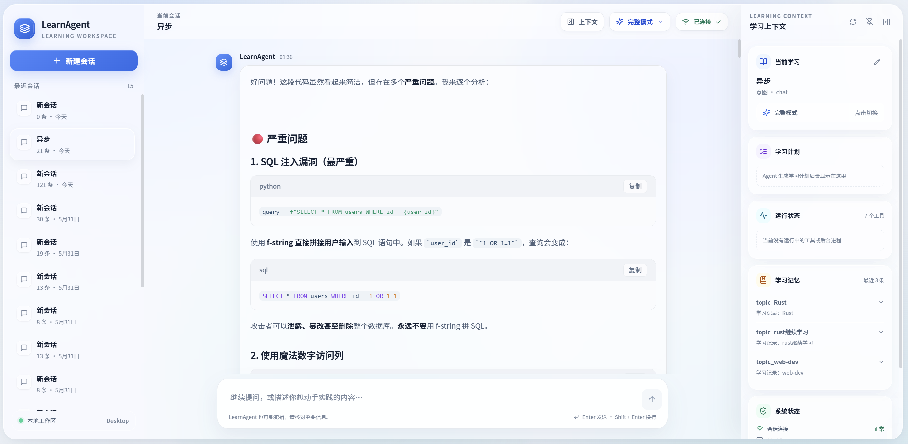
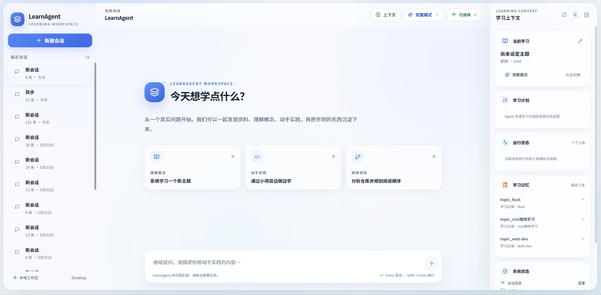

<p align="center">
  <h1 align="center">LearnAgent</h1>
  <p align="center">面向自学者的 AI 学习助手 —— 发现 · 理解 · 实践 · 复盘</p>
</p>

<p align="center">
  
  
  
  
  
</p>

<br>

<p align="center">
  
</p>

<p align="center">
  
</p>

---

## 目录

- [为什么用 LearnAgent](#为什么用-learnagent)
- [这是什么](#这是什么)
- [快速开始](#快速开始)
- [核心能力](#核心能力)
- [运行测试](#运行测试)
- [架构](#架构)
- [技术栈](#技术栈)
- [项目状态](#项目状态)

---

## 为什么用 LearnAgent

| 😵 自学的痛点 | ✅ LearnAgent 怎么解决 |
|---|---|
| 搜到一堆过时博文，不知道信哪个 | 自动搜索 + 多源交叉验证，优先官方文档 |
| 看懂了概念但不会写 | 直接在隔离 workspace 里生成可运行的示例代码 |
| 学了就忘，缺乏体系 | 持久化学习记忆，按主题追踪进度，随时复盘 |
| 想分析 GitHub 项目但无从下手 | 自动拉取 README / 目录结构 / 核心模块，摘要输出 |
| 学习路线不清晰 | LLM Router 诊断意图 → 分层递进拆解 → 生成练习任务 |

**一句话：** 你提问题，LearnAgent 替你搜、替你读、替你跑代码、替你整理笔记。

---

## 这是什么

LearnAgent 是一个**学习任务执行系统**——能主动搜索资料、阅读文档、分析仓库、创建示例项目、运行代码，并跟踪你的学习进度。

提供 **CLI 终端**和 **Web 界面**两种交互方式，共享同一套 Agent 引擎。

```text
❯ 我想学习 Flask

  🎯 意图: learn_concept · 主题: flask

  📁 新主题：flask
  📂 workspace: storage/workspace/flask

  ✅ 找到 5 条搜索结果 (3.6s)
     · Flask 入门教程 | 菜鸟教程
     · Welcome to Flask — Flask Documentation
     · Flask 入门指南 - 思否

  ✅ 读取网页，4,530 字符 (3.4s)

  ✅ 写入文件 learn_flask.py (0.1s)

  ✅ 执行完毕 (exit=0)，输出 156 字符 (2.1s)

  ── 搜索 ×3 · 阅读 ×2 · 创建文件 ×1 · 运行代码 ×2  |  ⏱ 38s
```

---

## 快速开始

### 0. 环境要求

- **Python** ≥ 3.10
- **Node.js** ≥ 18（仅 Web 界面需要）
- **Git**

### 1. 克隆项目

```bash
git clone git@github.com:DengYijunX/LearnAgent.git
cd LearnAgent
```

### 2. 创建虚拟环境

```bash
python -m venv .venv

# Windows
.venv\Scripts\activate

# macOS / Linux
source .venv/bin/activate
```

### 3. 安装依赖

```bash
pip install -e .
```

### 4. 配置 API Key

```bash
cp .env.example .env
```

编辑 `.env`，填写必填项：

```ini
DEEPSEEK_API_KEY=sk-xxxxxxxxxxxxxxxx    # 必填，从 platform.deepseek.com 获取
# 以下均为可选
# DEEPSEEK_BASE_URL=https://api.deepseek.com/v1
# DEEPSEEK_SMALL_MODEL=deepseek-chat
# DEEPSEEK_LARGE_MODEL=deepseek-chat
# STORAGE_BASE_DIR=storage
```

> `.env.example` 中包含所有可配置项的完整注释，需要时可参考。

### 5. 选择运行方式

#### 方式 A：CLI 终端

```bash
python -m app.main --real
```

启动后直接输入问题开始学习。常用命令：

| 命令 | 作用 |
|---|---|
| `/help` | 查看所有命令 |
| `/plan` | 切换到 Plan Mode（只读规划，不执行写操作） |
| `/topic 主题名` | 切换到指定学习主题 |
| `/status` | 查看当前会话状态 |
| `/sessions` | 列出历史会话 |
| `/resume latest` | 恢复上次会话（启动时用 `--resume latest`） |
| `/clear` | 清屏 |
| `/exit` | 退出 |

#### 方式 B：Web 界面

**启动后端：**

```bash
python -m app.server --reload
# 服务运行在 http://127.0.0.1:8000
```

**启动前端（开发模式）：**

```bash
cd web
npm install
npm run dev
# 前端运行在 http://localhost:5173，自动代理到后端
```

> 生产模式下无需单独启动前端 —— FastAPI 会自动 serve `web/dist/` 下的构建产物。只需先 `cd web && npm run build`，然后 `python -m app.server` 即可。

#### 方式 C：Mock 模式（无需 API Key）

```bash
python -m app.main
# 不传 --real，使用内置 Mock LLM，适合体验流程
```

### 6. 运行测试

```bash
pytest tests/ -v                    # 162 个单元测试（mock，无需网络）
RUN_REAL_TESTS=1 pytest tests/ -v   # 真实集成测试（需要 API Key）
```

更多参考：`.env.example` | `.mcp.example.json` | `python scripts/smoke_llm_real.py`

---

## 核心能力

**自动学习流程：** LLM Router 识别意图 → Skill 注入工作流 → Agent Loop 驱动工具调用

| 我能做什么 | 示例 |
|---|---|
| 学习新技术 | "我想学习 Rust 的 async/await" → 搜索 + 读文档 + 写示例 + 运行 |
| 分析 GitHub 仓库 | "https://github.com/huggingface/smolagents 分析这个项目" |
| 动手写代码 | 在隔离 workspace 中创建文件、运行 Python，结果实时展示 |
| 生成学习计划 | 拆解核心概念 → 分层递进路线 → 练习任务 |
| 复盘进度 | "复盘一下最近学的 Agent 架构" |
| 恢复上次会话 | `python -m app.main --real --resume latest` |

**7 个内置工具：** 搜索(DuckDuckGo) · 网页读取(BeautifulSoup4) · GitHub 分析 · 文件读写 · 代码执行(Docker Sandbox 可选) · 项目文件浏览 · 学习任务管理

**MCP 外部工具：** 通过 `.mcp.json` 接入第三方工具服务器（JSON-RPC 2.0）

**CLI 命令：** `/help` `/plan` `/topic` `/progress` `/sessions` `/memory` `/tools` `/status` `/clear`

### Web 特色功能

- **实时 WebSocket 对话** — 流式展示 Agent 思考、工具调用和回复
- **权限确认弹窗** — 写操作/代码执行需用户确认，分级可控
- **学习上下文面板** — 实时展示当前主题、学习计划、进度任务
- **后台进程管理** — 运行中的服务进程可查看输出、手动停止
- **多会话管理** — 侧边栏切换/创建会话，每个会话独立主题和 workspace
- **Apple 磨砂玻璃视觉** — 亮色主题，毛玻璃材质，精致排版

---

## 运行测试

```bash
pytest tests/ -v                   # 162 个单元测试 (mock，无需网络)
RUN_REAL_TESTS=1 pytest tests/ -v  # 真实集成测试 (需要 API key)
python scripts/sandbox_test.py --real  # 自动化端到端测试
```

---

## 架构

```
app/
├── main.py                      # CLI 入口
├── logging.py                   # 统一日志（CLI + Web 共用，按天轮转）
├── process_manager.py           # 后台进程管理器（运行服务监控）
├── config/settings.py           # .env 配置
├── llm/                         # LLM 层
│   ├── base.py                  #   LLMClient 抽象
│   ├── deepseek_client.py       #   DeepSeek (OpenAI-compatible)
│   ├── mock_client.py           #   Mock 实现（测试用）
│   └── model_selector.py        #   模型路由
├── tools/                       # 工具层
│   ├── base.py / registry.py    #   Tool 接口 + ToolRegistry
│   ├── search_web.py            #   DuckDuckGo 搜索
│   ├── read_url.py              #   网页读取 (BS4)
│   ├── github_analyzer.py       #   仓库分析 (免 token)
│   ├── workspace_tools.py       #   文件读写 + 代码执行 + Sandbox
│   └── todo_tools.py            #   学习任务管理
├── core/                        # 编排层
│   ├── agent_loop.py            #   Agent 循环 + 事件回调
│   ├── query_engine.py          #   会话编排 + Skill/Topic 管理
│   ├── llm_router.py            #   LLM 意图分类
│   ├── router.py                #   正则路由（降级）
│   └── session_context.py       #   ContextVar 会话上下文（协程安全）
├── context/                     # 上下文层
│   ├── context_builder.py       #   三段式 System Prompt
│   └── compaction.py            #   Token Budget 压缩
├── memory/                      # 持久化层
│   ├── session_store.py         #   JSONL 会话存储
│   └── memory_store.py          #   Markdown 长期记忆
├── safety/                      # 安全层
│   └── permission.py            #   权限分级
├── skills/                      # Skill 系统
│   └── loader.py                #   SKILL.md 加载
├── mcp/                         # MCP 外部工具
│   ├── client.py                #   JSON-RPC 2.0 客户端
│   ├── adapter.py               #   MCP → Tool 适配
│   └── loader.py                #   .mcp.json 配置
└── server/                      # Web 服务层
    ├── __main__.py              #   uvicorn 启动入口
    ├── app.py                   #   FastAPI 工厂 + WebSocket 端点
    ├── routes.py                #   REST API（会话/工具/配置/内存/进程）
    └── session_manager.py       #   多会话并发管理

web/                             # 前端 (Vue 3 + TypeScript)
├── src/
│   ├── App.vue                  #   根布局（侧边栏 + 对话面板）
│   ├── main.ts                  #   Vue 入口
│   ├── api/                     #   HTTP + WebSocket 客户端
│   ├── stores/                  #   Pinia 状态管理（会话/聊天/上下文）
│   ├── composables/             #   组合式函数（WebSocket / 上下文面板）
│   ├── components/
│   │   ├── chat/                #   聊天面板 / 消息列表 / 气泡 / 工具卡片
│   │   ├── context/             #   学习上下文面板（主题/计划/状态/记忆）
│   │   ├── layout/              #   侧边栏 / 顶栏
│   │   └── common/              #   权限弹窗 / 确认框 / Toast
│   ├── types/                   #   TypeScript 类型定义
│   └── utils/                   #   Markdown 渲染 + 代码高亮
├── index.html
├── vite.config.ts
└── tailwind.config.js

skills/                          # Skill 定义 (SKILL.md)
├── learn-concept/               #   学习概念工作流
├── read-repo/                   #   阅读仓库工作流
└── review-progress/             #   复盘进度工作流
```

---

## 技术栈

**后端：** `Python 3.10+` `asyncio` `FastAPI` `uvicorn` `httpx` `BeautifulSoup4` `ddgs` `prompt_toolkit` `pytest`

**前端：** `Vue 3` `TypeScript` `Vite` `Tailwind CSS` `Pinia` `marked` `highlight.js` `lucide-vue-next`

**LLM：** `DeepSeek API` (OpenAI-compatible) · `JSON-RPC 2.0` (MCP)

---

## 项目状态

当前分支 `agent/claude-rebuild` — Claude Code 从零构建路线。

| 阶段 | 内容 |
|---|---|
| Phase 1 | Agent 骨架、7 工具、LLM 双实现、Router、3 Skill、持久化、CLI |
| Phase 2 | Plan Mode、Token Budget、Docker Sandbox、BS4 ReadUrl、命令过滤 |
| Phase 3 | MCP 客户端（JSON-RPC + Tool Adapter） |
| Phase 4 | FastAPI Web 服务 + WebSocket 实时对话 |
| Phase 5 | Vue 3 前端（Apple 磨砂玻璃设计、权限弹窗、学习上下文面板） |
| 体验 | 进度展示、信任窗口、粘贴合并、Ctrl+C 确认、topic 管理、会话恢复、后台进程管理 |
| 测试 | 162 用例覆盖全部核心模块 |

---

## License

MIT
