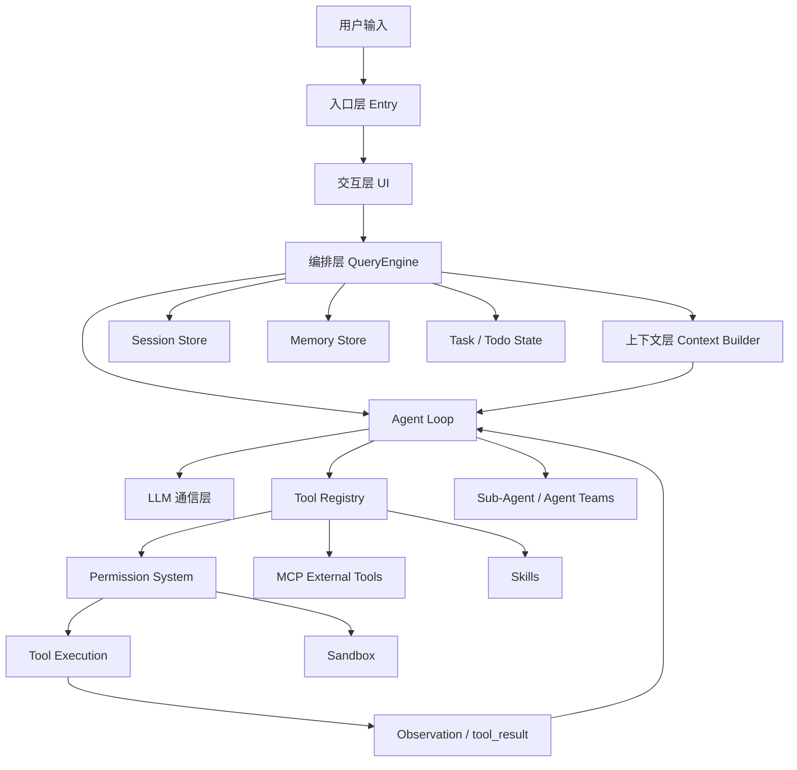

# 通用 Agent 设计参考说明（完整版）

> 基于 ConardLi/easy-agent 的 step1–step21 学习总结整理。  
> 目标：作为设计 LearnAgent、CodeReviewAgent、RAGAgent、ResearchAgent、CodingAgent 等工程化 Agent 前的通用参考模板。

---

## 0. 文档定位

这不是 Easy Agent 源码逐行笔记，而是一份**可复用的 Agent 架构设计参考说明**。

使用方式：

1. 设计任何 Agent 前，先用本说明检查系统分层是否完整。
2. 实现 MVP 时，可从“最小闭环”章节开始。
3. 后续做工程化增强时，再逐步补充 Memory、Task、Skills、MCP、Sandbox、Sub-Agent、Agent Teams 等能力。

核心观点：

```text
Agent 不是一个 Prompt，也不是一次 LLM API 调用。
Agent 是一个运行时系统：
LLM + Tools + Context + Memory + Permission + Loop + Task + Extension。
```

---

## 1. 从 Easy Agent 得到的整体启发

Easy Agent 的公开 README 将系统分成五层：

```text
1. 交互层：终端 UI、输入处理、渲染输出
2. 编排层：多轮会话流转、usage、命令控制
3. 核心 Agentic Loop：推理 -> 调工具 -> 观察结果 -> 继续推理
4. 工具层：文件、Shell、搜索等本地行动能力
5. 通信层：与大模型之间的流式通信
```

这五层可以进一步扩展成通用 Agent 的十层架构：

```text
Agent System
├── 1. Entry Layer 入口层
├── 2. UI Layer 交互层
├── 3. Orchestration Layer 编排层
├── 4. Agent Loop 核心循环层
├── 5. LLM Layer 模型通信层
├── 6. Tool Layer 工具层
├── 7. Context Layer 上下文层
├── 8. State / Memory Layer 状态与记忆层
├── 9. Safety Layer 权限与安全层
└── 10. Extension Layer 扩展层
```

---

## 2. Easy Agent step1–step21 总览

| 阶段 | 模块 | 核心价值 | 通用可复用点 |
|---:|---|---|---|
| step1 | LLM 流式通信层 | 支持 text/tool_use 事件流 | 封装模型客户端，统一消息格式 |
| step2 | React/Ink 终端 UI | 终端交互、流式渲染 | UI 只负责展示，不承载 Agent 核心逻辑 |
| step3 | Tool 接口与 Read 工具 | 定义工具契约 | name/description/inputSchema/call/isReadOnly |
| step4 | Agentic Loop | LLM 调工具、工具结果回传 | Agent 最小闭环 |
| step5 | 核心工具集 | Read/Write/Edit/Grep/Glob/Bash | 查找、读取、修改、创建、执行 |
| step6 | System Prompt 与上下文工程 | 静态规则 + 动态上下文 | Context Builder |
| step7 | 权限控制系统 | allow/ask/deny | 工具执行前必须过权限门 |
| step8 | QueryEngine | 管理多轮会话和命令 | 编排层核心对象 |
| step9 | Session 持久化 | JSONL 保存会话历史 | 可恢复、可审计 |
| step10 | Project Memory | Markdown 长期记忆 | Memory 与 Transcript 分离 |
| step11 | Context Compaction | 上下文压缩 | summary + recent tail |
| step12 | Token Budget | 精细预算管理 | warning/error/blocking |
| step13 | Plan Mode | 先只读探索，再执行 | 复杂任务前置计划 |
| step14 | TodoWrite | 会话任务跟踪 | 当前任务看板 |
| step15 | Task V2 | 持久化任务图 | ID、依赖、跨会话恢复 |
| step16 | MCP | 外部工具接入 | 外部工具统一适配为 Tool |
| step17 | Skills | 可复用工作流 | SKILL.md 封装套路 |
| step18 | Sandbox | Bash 运行时隔离 | 权限之外的执行隔离 |
| step19 | Sub-Agent | 子 Agent 定义与隔离执行 | 委派任务、隔离上下文、工具池过滤 |
| step20 | Background Agent / Worktree | 后台执行与 Git worktree 隔离 | 长任务异步运行、隔离工作区 |
| step21 | Agent Teams | 多 Agent 团队协作 | 队伍、队友、消息箱、协作通信 |

---

## 3. Agent 的最小闭环

最小 Agent 不需要一开始实现所有高级功能，但必须有闭环。

```text
用户输入
→ QueryEngine 接收
→ 构造 System Prompt
→ 调用 LLM
→ LLM 输出 text 或 tool_use
→ 如果有 tool_use，执行工具
→ 生成 tool_result
→ tool_result 放回 messages
→ 再次调用 LLM
→ 直到完成或达到最大轮数
```

伪代码：

```python
async def agent_loop(messages, system_prompt, tools, max_turns=8):
    for turn in range(max_turns):
        assistant_message = await llm.chat(
            messages=messages,
            system=system_prompt,
            tools=tools.to_api_schema(),
        )

        messages.append(assistant_message)

        tool_calls = extract_tool_calls(assistant_message)
        if not tool_calls:
            return {"messages": messages, "reason": "completed"}

        tool_results = []

        for call in tool_calls:
            tool = tools.find(call.name)
            if not tool:
                tool_results.append(error_tool_result(call.id, "Unknown tool"))
                continue

            decision = check_permission(tool, call.input)
            if decision.behavior == "deny":
                tool_results.append(error_tool_result(call.id, decision.reason))
                continue

            if decision.behavior == "ask":
                approved = ask_user(decision.summary)
                if not approved:
                    tool_results.append(error_tool_result(call.id, "User rejected"))
                    continue

            result = await tool.call(call.input, context={})
            tool_results.append(format_tool_result(call.id, result))

        messages.append({
            "role": "user",
            "content": tool_results,
        })

    return {"messages": messages, "reason": "max_turns"}
```

关键原则：

```text
1. assistant 的 tool_use 必须保留在 messages 中。
2. tool_result 必须作为后续 user message 放回 messages。
3. tool_use 和 tool_result 需要通过 id 对齐。
4. 必须有 max_turns，防止无限循环。
5. 工具错误也应该作为 observation 返回给模型。
```

---

## 4. 通用系统架构图



---

## 5. Entry Layer：入口层

入口层负责启动系统、解析基础参数、初始化环境。

常见入口：

```text
CLI
Web API
Web UI
IDE 插件
Webhook
定时任务
脚本模式
管道模式
```

推荐职责：

```text
1. 读取配置。
2. 初始化模型客户端。
3. 初始化工具注册表。
4. 初始化 QueryEngine。
5. 将用户输入交给 QueryEngine。
```

不要在入口层直接写 Agent Loop。

---

## 6. UI Layer：交互层

UI 只负责展示和接收输入，不负责核心智能逻辑。

它可以展示：

```text
模型流式输出
工具调用开始/结束
权限确认弹窗
任务 Todo
子 Agent 进度
后台任务通知
Token 使用情况
错误提示
文件 diff
```

设计原则：

```text
UI 是状态的消费者，不是状态的所有者。
QueryEngine 才是会话状态的所有者。
```

---

## 7. QueryEngine：编排层

QueryEngine 是 Agent 的运行时控制器。

它负责：

```text
1. 管理 messages。
2. 管理 sessionId。
3. 管理当前模型。
4. 处理 slash command。
5. 构造 system prompt。
6. 检查 token budget。
7. 调用 agent_loop。
8. 保存 session。
9. 更新 usage。
10. 处理中断。
11. 管理当前 permission mode。
12. 协调 Todo、Task、Sub-Agent、Background Agent。
```

参考结构：

```python
class QueryEngine:
    def __init__(self, llm, tools, memory_store, session_store):
        self.llm = llm
        self.tools = tools
        self.memory_store = memory_store
        self.session_store = session_store
        self.messages = []
        self.total_usage = {"input_tokens": 0, "output_tokens": 0}
        self.permission_mode = "default"
        self.session_id = create_session_id()

    async def submit_message(self, user_input: str):
        if user_input.startswith("/"):
            return await self.handle_command(user_input)

        self.messages.append({"role": "user", "content": user_input})

        self.messages = await maybe_compact(self.messages)

        system_prompt = await build_system_prompt(
            memory_store=self.memory_store,
            session_id=self.session_id,
        )

        result = await agent_loop(
            messages=self.messages,
            system_prompt=system_prompt,
            tools=self.tools,
            permission_mode=self.permission_mode,
        )

        self.messages = result["messages"]
        await self.session_store.append_messages(self.session_id, self.messages)
        return result
```

---

## 8. LLM Layer：模型通信层

模型通信层应该统一封装，而不是散落在业务代码中。

应支持：

```text
chat
stream_chat
tool calling
usage 获取
错误重试
base_url 切换
model 切换
max_tokens 控制
stop_reason 识别
```

接口示例：

```python
class LLMClient:
    async def chat(self, messages, system=None, tools=None, max_tokens=None):
        raise NotImplementedError

    async def stream_chat(self, messages, system=None, tools=None, max_tokens=None):
        raise NotImplementedError
```

推荐不要在业务逻辑里直接写：

```python
requests.post(url, json=payload)
```

而应该统一走：

```python
llm_client.chat(...)
```

---

## 9. Tool Layer：工具层

工具是 Agent 的行动能力。

### 9.1 Tool 标准接口

```python
class Tool:
    name: str
    description: str
    input_schema: dict

    def is_read_only(self) -> bool:
        return True

    def is_enabled(self) -> bool:
        return True

    async def call(self, tool_input: dict, context: dict) -> dict:
        raise NotImplementedError
```

### 9.2 ToolRegistry

```python
class ToolRegistry:
    def __init__(self):
        self.tools = {}

    def register(self, tool: Tool):
        self.tools[tool.name] = tool

    def find(self, name: str):
        return self.tools.get(name)

    def to_api_schema(self):
        return [
            {
                "name": tool.name,
                "description": tool.description,
                "input_schema": tool.input_schema,
            }
            for tool in self.tools.values()
            if tool.is_enabled()
        ]
```

### 9.3 工具分类

```text
只读工具：
ReadFile、Grep、Glob、SearchWeb、ReadUrl、SearchMemory、ReadRepo

写入工具：
WriteFile、EditFile、SaveMemory、SaveNote、TodoWrite

执行工具：
Bash、RunCode、RunTest、InstallPackage

外部工具：
MCP GitHub、MCP Notion、MCP Browser、MCP RAG、MCP Database
```

### 9.4 工具设计原则

```text
1. 工具参数必须校验。
2. 文件路径必须限制在 workspace 内。
3. 工具错误不要抛崩主程序，要返回 isError。
4. 工具结果要截断，防止撑爆上下文。
5. 写入和执行类工具必须走权限系统。
6. 工具名和 schema 要对模型足够清晰。
```

---

## 10. Context Layer：上下文层

上下文层决定模型每轮看到什么。

上下文来源：

```text
System Prompt
用户当前输入
历史 messages
当前任务状态
项目记忆
用户偏好
工具列表
当前文件/项目环境
Git 状态
Token budget
Sub-Agent/Team 状态
```

推荐将 System Prompt 分成两部分：

```text
Static Context：长期稳定规则
Dynamic Context：当前环境和当前任务状态
```

示例：

```text
<STATIC_CONTEXT>
You are an agent specialized in a specific task domain.
Use tools instead of guessing.
Ask before destructive actions.
Keep responses concise and grounded.
</STATIC_CONTEXT>

<DYNAMIC_CONTEXT>
Current project: ...
Current mode: default / plan / auto
Current session: ...
Relevant memory: ...
Current todos: ...
Available agents: ...
</DYNAMIC_CONTEXT>
```

原则：

```text
Prompt 不是越长越好。
Context Builder 的目标是：让模型看到本轮决策最需要的信息。
```

---

## 11. Context Compaction 与 Token Budget

长会话必然会导致上下文膨胀，因此需要上下文治理。

### 11.1 Token 预算状态

```text
normal：正常
warning：接近上限
error：应该自动压缩
blocking：不能继续提交，需要压缩或清空
```

### 11.2 压缩策略

```text
第一步：Micro Compact
清理旧 tool_result 的大段内容，保留结构和占位符。

第二步：Full Compact
用模型总结旧历史，保留最近 tail。

第三步：Safe Tail
保留最近消息时，不能切断 tool_use / tool_result 配对。
```

压缩后的 messages 结构：

```text
user: 这是此前对话摘要……
assistant: [CompactBoundary]
最近若干条原始 messages
```

### 11.3 工具结果截断

所有大工具输出进入 messages 前都应该先截断：

```text
Bash 长输出
Read 大文件
Grep 大量匹配
网页全文
PDF 解析全文
Repo 文件列表
```

---

## 12. Memory 与 Session

### 12.1 Session：会话流水

保存完整对话轨迹，适合恢复和审计。

推荐 JSONL：

```json
{"type": "session_meta", "sessionId": "...", "startedAt": "..."}
{"type": "message", "message": {"role": "user", "content": "..."}}
{"type": "tool_event", "name": "Read", "phase": "done"}
{"type": "usage", "input_tokens": 1000, "output_tokens": 300}
```

### 12.2 Memory：长期记忆

长期记忆不是聊天流水，而是未来多次会话仍然有用的信息。

适合保存：

```text
用户长期偏好
项目技术栈
常用命令
重要架构决策
学习进度
模型/API 配置
领域知识索引
```

推荐 Markdown + frontmatter：

```md
---
name: project_config
description: Project configuration and model choices.
type: project
---

- LLM provider: SiliconFlow
- Chat model: Qwen/Qwen2.5-7B-Instruct
- Embedding model: BAAI/bge-m3
```

核心原则：

```text
Session 是流水账。
Memory 是提炼后的长期知识。
不要把所有对话都塞进 Memory。
```

---

## 13. Permission System：权限系统

最小权限模型：

```text
allow：自动允许
ask：询问用户
deny：直接拒绝
```

通用规则：

```text
只读工具：默认 allow
写入工具：默认 ask
执行工具：默认 ask
危险命令：默认 deny
Plan Mode：禁止写入和执行
Sandboxed Bash：可适当自动 allow，但危险命令仍 deny
```

示例：

```python
def check_permission(tool, tool_input, mode="default"):
    if mode == "plan" and not tool.is_read_only():
        return deny("Plan mode blocks write actions")

    if tool.name == "Bash":
        command = tool_input.get("command", "")
        if is_dangerous_command(command):
            return deny("Dangerous command")
        if is_read_only_command(command):
            return allow("Read-only command")
        return ask("Shell command may change local state")

    if tool.is_read_only():
        return allow("Read-only tool")

    return ask("Tool writes local state")
```

危险命令示例：

```text
rm -rf
sudo
git push
git reset --hard
shutdown
reboot
curl | sh
pip install unknown-package
npm install unknown-package
```

---

## 14. Plan Mode：计划模式

Plan Mode 的意义：

```text
复杂任务不要一上来就改文件或执行命令。
先只读探索，形成计划，再让用户确认。
```

典型流程：

```text
用户提出复杂任务
→ EnterPlanMode
→ 只允许 Read/Grep/Glob/Search 等只读工具
→ 分析项目/资料
→ 生成 plan.md
→ ExitPlanMode
→ 用户确认或系统切回 default
→ 正式执行
```

适用场景：

```text
多文件重构
复杂报告生成
学习路线规划
科研系统设计
数据库迁移
安全敏感任务
大型代码审查
```

---

## 15. Todo 与 Task Graph

### 15.1 TodoWrite：会话级任务看板

适合当前会话内短任务进度：

```json
{
  "todos": [
    {
      "content": "分析项目结构",
      "activeForm": "正在分析项目结构",
      "status": "completed"
    },
    {
      "content": "实现 memory_store",
      "activeForm": "正在实现 memory_store",
      "status": "in_progress"
    }
  ]
}
```

### 15.2 Task Graph：长期任务图

适合跨会话、多阶段、存在依赖关系的任务：

```text
#1 分析项目结构
#2 设计模块
#3 实现代码
#4 编写测试

#1 blocks #2
#2 blocks #3
#3 blocks #4
```

区别：

| 维度 | TodoWrite | Task Graph |
|---|---|---|
| 生命周期 | 当前会话 | 跨会话 |
| 存储 | 内存或轻量状态 | 持久化 JSON/DB |
| 是否有 ID | 无 | 有稳定 ID |
| 是否有依赖 | 无 | 有 blocks/blockedBy |
| 适合 | 当前进度条 | 长期项目/学习路线 |

---

## 16. MCP：外部工具扩展

MCP 的作用：

```text
把外部工具服务器动态接入 Agent。
```

例如：

```text
GitHub MCP
Notion MCP
Browser MCP
Database MCP
RAG MCP
Sandbox MCP
Search MCP
```

关键设计：

```text
MCP 工具进入 Agent 后，也要被包装成统一 Tool：
name
description
input_schema
is_read_only
call()
```

命名空间建议：

```text
mcp__github__create_issue
mcp__notion__save_note
mcp__rag__search_docs
mcp__browser__read_page
```

原则：

```text
无论工具来自内置还是 MCP，进入 Agent Loop 后都应该统一成 Tool。
```

---

## 17. Skills：可复用工作流

Skill 不是工具，而是工作流说明书。

Tool 解决：

```text
Agent 能做什么动作？
```

Skill 解决：

```text
Agent 遇到某类任务应该按什么流程做？
```

Skill 文件示例：

```md
---
name: review-code
description: Review code for correctness, maintainability, and testability.
when_to_use: Use when the user asks for code review.
allowed-tools:
  - Read
  - Grep
  - Glob
---

请按以下流程进行代码审查：

1. 先读取目标文件。
2. 查找相关依赖和测试。
3. 从正确性、边界条件、可维护性、测试覆盖四方面分析。
4. 输出问题、风险等级、证据和修改建议。
```

设计原则：

```text
System Prompt 里只列技能索引。
真正需要时再调用 Skill 工具加载完整正文。
```

---

## 18. Sandbox：沙箱机制

Sandbox 是执行时安全层。

权限系统回答：

```text
能不能执行？
```

Sandbox 回答：

```text
即使执行了，它能访问什么？能写哪里？能不能联网？
```

适合隔离：

```text
Bash
RunCode
RunTest
学生代码
第三方脚本
未知依赖命令
```

Sandbox 应限制：

```text
运行时间
内存
CPU
文件读写范围
网络访问
输出长度
敏感路径
```

跨平台建议：

```text
macOS：sandbox-exec
Linux：Docker / bubblewrap / firejail / nsjail
Windows：Docker / WSL / Windows Sandbox
通用：Docker 最容易落地
```

---

## 19. Sub-Agent：子 Agent 与 Agent 定义系统

step19 引入了 Sub-Agent。

核心目标：

```text
1. 加载内置/自定义 Agent 定义。
2. 把可用子 Agent 注入 system prompt。
3. 为子 Agent 过滤工具池。
4. 让子 Agent 在隔离 messages 中运行。
5. 通过 Agent 工具暴露委派能力。
```

### 19.1 为什么需要 Sub-Agent？

主 Agent 的上下文有限，而且复杂任务往往可以拆成独立子任务。

例如：

```text
主 Agent：负责整体规划和最终整合。
Explore Agent：只读搜索代码。
Review Agent：审查某个模块。
Test Agent：分析失败测试。
Docs Agent：整理文档。
```

Sub-Agent 的价值：

```text
隔离上下文
降低主上下文污染
让专门任务用专门 prompt
限制子 Agent 工具权限
并行化或后台化的基础
```

### 19.2 Agent 定义文件

可以用 Markdown + frontmatter 定义自定义 Agent：

```md
---
name: Explore
description: Read-only code search and exploration agent.
tools:
  - Read
  - Grep
  - Glob
disallowedTools:
  - Write
  - Edit
model: claude-sonnet
maxTurns: 20
permissionMode: plan
---

You are a read-only exploration agent.
Do not modify files.
Return concise findings with file paths and evidence.
```

字段建议：

```text
name：Agent 类型名
description：什么时候用
tools：允许的工具白名单
disallowedTools：禁用工具
model：可选模型覆盖
maxTurns：最大轮数
permissionMode：权限模式
正文：子 Agent system prompt
```

### 19.3 Agent Registry

Agent 系统需要注册表：

```text
built-in agents
user agents
project agents
```

覆盖规则建议：

```text
project agent > user agent > built-in agent
```

### 19.4 子 Agent 工具过滤

主 Agent 可用全部工具，但子 Agent 不一定能用全部工具。

```python
def resolve_agent_tools(agent, available_tools):
    disallowed = set(["Agent"] + agent.disallowed_tools)
    base = [t for t in available_tools if t.name not in disallowed]

    if not agent.tools or "*" in agent.tools:
        return base

    return [t for t in base if t.name in agent.tools]
```

一定要禁止子 Agent 默认再调用 `Agent`，否则可能出现递归委派失控。

### 19.5 Agent Tool

主 Agent 通过 `Agent` 工具调用子 Agent：

```json
{
  "prompt": "Find where sandbox command wrapping is implemented.",
  "description": "Explore sandbox implementation",
  "subagent_type": "Explore",
  "model": "optional-model"
}
```

注意：

```text
子 Agent 的 prompt 必须自包含。
子 Agent 不应该默认看到父 Agent 完整历史。
子 Agent 最终返回 concise summary 给主 Agent。
```

### 19.6 适用场景

```text
代码库探索
资料搜集
多文件审查
长文档总结
测试失败定位
安全审计
报告资料分工
学习资料搜集
```

---

## 20. Background Agent 与 Worktree 隔离

step20 在 Sub-Agent 基础上增加两个重要能力：

```text
1. 子 Agent 后台执行。
2. 子 Agent 可在 Git worktree 中隔离运行。
```

### 20.1 为什么需要后台 Agent？

有些任务耗时长，不适合阻塞主对话：

```text
全仓库代码审查
大规模测试修复
长文档总结
多文件迁移
安全扫描
资料搜集
```

后台执行流程：

```text
主 Agent 调用 Agent(run_in_background=true)
→ 创建 async agent 记录
→ 创建 output JSONL 文件
→ 后台运行子 Agent
→ 主对话立即返回 agent_id 和 output_file
→ 子 Agent 持续写入进度
→ 完成后通知主对话
```

### 20.2 后台任务状态

建议维护：

```text
agentId
agentType
description
prompt
outputFile
status: running/completed/failed/killed
startedAt
durationMs
totalTokens
toolUseCount
lastToolName
finalText
error
```

### 20.3 Output JSONL

后台任务输出适合用 JSONL：

```json
{"timestamp":"...", "type":"started", "agentType":"Explore"}
{"timestamp":"...", "type":"text", "text":"started child work"}
{"timestamp":"...", "type":"tool_use", "toolName":"Read"}
{"timestamp":"...", "type":"tool_result", "toolName":"Read", "isError":false}
{"timestamp":"...", "type":"turn_usage", "totalTokens":130}
{"timestamp":"...", "type":"completed", "finalText":"..."}
```

好处：

```text
可 tail
可恢复
可审计
不阻塞主对话
```

### 20.4 通知队列

后台 Agent 完成后，不应该直接打断主流程，而是进入 pending notification queue。

主 Agent 后续可以 drain notifications：

```text
后台任务完成：agent_id=...
输出文件：...
最终摘要：...
tokens=...
tools=...
duration_ms=...
```

### 20.5 Git Worktree 隔离

对于会修改代码的子 Agent，可以让它在 git worktree 中运行：

```text
主仓库保持不动
子 Agent 在独立 worktree 分支中修改
任务完成后：
  如果 worktree 干净 → 自动删除
  如果有改动 → 保留 worktree 和 branch，让用户检查
```

流程：

```text
findGitRoot(cwd)
→ git rev-parse HEAD
→ git worktree add -B worktree-agent-xxx <path> HEAD
→ 子 Agent 在 worktreePath 中运行
→ 检查 git status 和 head..HEAD
→ clean 则 remove worktree
→ dirty 则保留
```

适用场景：

```text
风险较高的自动修改
并行实现多个方案
让多个 Agent 同时改不同方向
生成实验性补丁
```

### 20.6 设计原则

```text
后台 Agent 适合长任务。
Worktree 适合会修改代码的长任务。
后台任务必须有 output 文件。
后台任务必须可 kill。
后台任务完成必须通知主 Agent。
```

---

## 21. Agent Teams：多 Agent 协作

step21 进一步将多个后台子 Agent 组织成团队。

核心目标：

```text
1. 每个 session 最多一个 active team。
2. 通过 Agent({ name, team_name, ... }) 生成命名队友。
3. 队友之间通过 inbox 文件收发消息。
4. 队友下一轮执行前注入未读消息。
5. 只有队友都结束后才能删除团队。
```

### 21.1 为什么需要 Agent Teams？

Sub-Agent 是单次委派。Agent Teams 是多角色协作。

适合任务：

```text
大型项目重构
多模块并行分析
复杂报告写作
前后端分工
代码审查 + 测试 + 文档并行
研究资料多方向搜集
```

示例团队：

```text
team-lead：主控，拆任务、整合结果
backend：分析后端接口
test：补测试和跑测试
docs：整理文档
reviewer：审查方案风险
```

### 21.2 Team 文件

团队状态可以保存为：

```json
{
  "name": "dev-team",
  "description": "Refactor auth module",
  "createdAt": 123456789,
  "leadAgentId": "team-lead@dev-team",
  "members": [
    {
      "agentId": "team-lead@dev-team",
      "name": "team-lead",
      "agentType": "team-lead",
      "joinedAt": 123456789,
      "isActive": true
    },
    {
      "agentId": "backend@dev-team",
      "name": "backend",
      "agentType": "general-purpose",
      "joinedAt": 123456790,
      "isActive": true,
      "outputFile": "..."
    }
  ]
}
```

### 21.3 TeamCreate

创建团队：

```json
{
  "team_name": "dev-team",
  "description": "Refactor auth module"
}
```

限制：

```text
Agent Teams 必须显式启用。
同一个 session 不能同时 lead 两个 team。
team-lead 是保留名。
```

### 21.4 命名队友

通过 Agent 工具生成队友：

```json
{
  "prompt": "Work on backend API migration.",
  "description": "Backend work",
  "subagent_type": "general-purpose",
  "name": "backend",
  "team_name": "dev-team",
  "run_in_background": true
}
```

规则：

```text
name 和 team_name 必须同时设置。
命名队友必须后台运行。
队友不能再生成嵌套队友。
team_name 必须匹配当前 active team。
```

### 21.5 SendMessage：队友通信

队友通过 inbox 文件通信。

发送给单个队友：

```json
{
  "to": "backend",
  "summary": "API change",
  "message": "The auth endpoint moved to /v2/login."
}
```

广播：

```json
{
  "to": "*",
  "summary": "Global update",
  "message": "All modules should use the new config loader."
}
```

消息结构：

```json
{
  "from": "team-lead",
  "text": "...",
  "timestamp": "...",
  "summary": "...",
  "read": false
}
```

### 21.6 Inbox 注入

队友下一轮执行前，系统读取未读消息：

```text
drainUnreadMessages(agentName, teamName)
→ 标记 read=true
→ formatMailboxAttachment(messages)
→ 注入子 Agent 下一轮上下文
```

这样队友就能看到其他成员或 team lead 的新指令。

### 21.7 TeamDelete

团队删除必须满足：

```text
当前有 active team
team 文件存在
除 team-lead 外，没有 active teammates
```

如果仍有 active 队友：

```text
拒绝删除团队
提示哪些队友仍然 active
```

### 21.8 设计原则

```text
Agent Teams 是 Sub-Agent + Background Agent + Mailbox 的组合。
Team Lead 负责拆任务和整合。
Teammate 负责长任务并后台运行。
Mailbox 负责跨 Agent 通信。
团队不能无限嵌套。
团队删除必须等待队友结束。
```

---

## 22. Hooks：生命周期系统（规划阶段）

当前 Easy Agent README 说明阶段 22 Hooks 仍是下一阶段重点，尚未完成。

虽然 step22 还没有教程化代码，但从 Agent 架构角度，Hooks 应该用于：

```text
工具调用前
工具调用后
文件编辑前
文件编辑后
Bash 执行前
Bash 执行后
会话开始
会话结束
compact 前后
sub-agent 启动/结束
background agent 完成
```

可能用途：

```text
自动格式化
自动 lint
自动测试
危险命令拦截
审计日志
权限增强
通知系统
保存快照
生成 diff summary
```

设计建议：

```python
class HookManager:
    async def emit(self, event_name: str, payload: dict):
        for hook in self.hooks[event_name]:
            await hook(payload)
```

注意边界：

```text
Hooks 不应该替代 Agent Loop。
Hooks 不应该承担复杂智能决策。
Hooks 更适合确定性脚本、审计和自动化动作。
```

---

## 23. 通用 Agent 目录模板

```text
agent-project/
├── app/
│   ├── main.py
│   ├── entrypoint/
│   │   ├── cli.py
│   │   └── api.py
│   ├── ui/
│   │   └── renderer.py
│   ├── core/
│   │   ├── query_engine.py
│   │   ├── agent_loop.py
│   │   ├── events.py
│   │   └── router.py
│   ├── llm/
│   │   ├── base.py
│   │   ├── openai_client.py
│   │   ├── siliconflow_client.py
│   │   └── local_client.py
│   ├── tools/
│   │   ├── base.py
│   │   ├── registry.py
│   │   ├── file_tools.py
│   │   ├── search_tools.py
│   │   ├── code_tools.py
│   │   └── mcp_adapter.py
│   ├── context/
│   │   ├── system_prompt.py
│   │   ├── context_builder.py
│   │   ├── token_budget.py
│   │   └── compaction.py
│   ├── memory/
│   │   ├── session_store.py
│   │   ├── memory_store.py
│   │   └── memory_index.py
│   ├── safety/
│   │   ├── permission.py
│   │   ├── sandbox.py
│   │   └── validators.py
│   ├── tasks/
│   │   ├── todo.py
│   │   ├── task_store.py
│   │   └── task_graph.py
│   ├── agents/
│   │   ├── agent_registry.py
│   │   ├── sub_agent.py
│   │   ├── background_agent.py
│   │   └── team.py
│   ├── skills/
│   │   ├── loader.py
│   │   ├── registry.py
│   │   └── skill_tool.py
│   ├── hooks/
│   │   ├── manager.py
│   │   └── events.py
│   └── config/
│       └── settings.py
├── skills/
│   └── example-skill/
│       └── SKILL.md
├── agents/
│   └── explore.md
├── data/
├── tests/
└── README.md
```

---

## 24. MVP 开发顺序

不要一开始就做完整 Claude Code 级系统。建议按阶段实现。

### 阶段 1：最小可用 Agent

```text
1. LLMClient
2. Tool 接口
3. ToolRegistry
4. Agent Loop
5. QueryEngine
6. 2-3 个基础工具
```

目标：

```text
用户输入 → LLM → tool_use → 工具执行 → tool_result → LLM 最终回答
```

### 阶段 2：工程化基础

```text
1. System Prompt 分层
2. Permission allow/ask/deny
3. Session JSONL
4. Memory Markdown
5. TodoWrite
6. Token 估算与工具结果截断
```

目标：

```text
能持续使用、能保存历史、能避免危险操作、能跟踪任务。
```

### 阶段 3：复杂任务能力

```text
1. Plan Mode
2. Context Compaction
3. Task Graph
4. Skills
5. MCP
6. Sandbox
```

目标：

```text
能处理复杂任务，有计划、有长期记忆、有扩展能力、有安全边界。
```

### 阶段 4：多 Agent 能力

```text
1. Sub-Agent
2. Background Agent
3. Worktree Isolation
4. Agent Teams
5. Hooks
```

目标：

```text
能委派任务、并行运行、隔离修改、多角色协作。
```

---

## 25. 构建任何 Agent 前的检查清单

### 25.1 任务定位

```text
这个 Agent 解决什么问题？
它是问答型、执行型、学习型、开发型、研究型还是混合型？
用户输入是什么？
最终输出是什么？
它需要主动行动吗？
```

### 25.2 工具设计

```text
需要哪些只读工具？
需要哪些写入工具？
需要哪些执行工具？
哪些工具有风险？
工具参数如何校验？
工具结果如何截断？
工具错误如何反馈给模型？
```

### 25.3 上下文设计

```text
模型每轮需要看到哪些信息？
哪些是静态规则？
哪些是动态上下文？
哪些信息来自 memory？
哪些来自当前 session？
上下文过长怎么压缩？
```

### 25.4 记忆设计

```text
哪些信息值得长期保存？
哪些只是会话历史？
Memory 用 Markdown、JSON、数据库还是向量库？
如何避免 Memory 变成垃圾堆？
```

### 25.5 权限与安全

```text
哪些操作自动允许？
哪些操作需要确认？
哪些操作永远禁止？
是否需要 Plan Mode？
是否需要 Sandbox？
是否需要 Worktree？
```

### 25.6 任务管理

```text
是否需要 Todo？
是否需要 Task Graph？
是否需要跨会话恢复任务？
是否需要展示当前进度？
是否需要后台任务？
```

### 25.7 多 Agent

```text
是否需要 Sub-Agent？
子 Agent 是否隔离上下文？
子 Agent 能使用哪些工具？
是否需要后台执行？
是否需要多 Agent 团队？
Agent 之间如何通信？
```

### 25.8 扩展机制

```text
是否需要 Skills？
是否需要 MCP？
是否需要 Hooks？
是否需要插件系统？
```

---

## 26. 常见错误设计

```text
1. 只有 Prompt，没有 Agent Loop。
2. 只有 LLM API 封装，没有工具系统。
3. 工具没有统一接口，后期难维护。
4. 没有权限系统，模型能随便写文件和执行命令。
5. 没有 Session，退出后上下文全丢。
6. Memory 什么都存，最后变成垃圾堆。
7. 不做 Token Budget，长对话必然爆上下文。
8. 工具结果不截断，一次 Bash 输出撑爆上下文。
9. 没有 Plan Mode，复杂任务一上来就乱改。
10. UI 和 Agent 核心耦合，无法迁移到 Web/API。
11. Skill 和 Tool 混淆。
12. Sub-Agent 默认继承全部工具，权限过大。
13. 后台任务没有 output 文件，无法追踪。
14. 多 Agent 没有消息机制，只是多个模型调用。
15. Hooks 承担智能决策，导致系统不可控。
```

---

## 27. 不同类型 Agent 的模块选择建议

| Agent 类型 | 必选模块 | 建议模块 | 可后置模块 |
|---|---|---|---|
| 学习型 Agent | QueryEngine、Memory、Task、Skills | Search/ReadUrl、Plan Mode | MCP、Sandbox、Agent Teams |
| Coding Agent | Tool、Permission、Sandbox、Session | Plan Mode、Task、Sub-Agent | Agent Teams、Hooks |
| RAG Agent | Context、Memory、Search Tools | Token Budget、Skills | Sub-Agent、MCP |
| Research Agent | Search、ReadUrl、Memory、Task | Sub-Agent、Background Agent | Agent Teams |
| CodeReview Agent | Read/Grep、Skills、Task | Plan Mode、Sub-Agent | Teams、Worktree |
| 自动开发 Agent | Full Tool、Permission、Sandbox | Worktree、Background、Hooks | Agent Teams |

---

## 28. 最终架构公式

可以用这个公式记住工程化 Agent：

```text
Agent
= QueryEngine
+ AgentLoop
+ LLMClient
+ ToolRegistry
+ ContextBuilder
+ MemoryStore
+ PermissionSystem
+ TaskTracker
+ ExtensionSystem
+ SafetyRuntime
```

如果进一步升级为多 Agent 系统：

```text
Multi-Agent System
= Agent Core
+ SubAgent Registry
+ Background Runtime
+ Isolation Workspace
+ Mailbox / Coordination
+ Team Lifecycle
```

---

## 29. 对 LearnAgent 的预映射

后续设计 LearnAgent 时，可以这样映射：

| 通用模块 | LearnAgent 中的形式 |
|---|---|
| QueryEngine | LearnQueryEngine |
| Agent Loop | 学习任务执行循环 |
| ToolRegistry | 学习工具注册表 |
| SearchWeb | 搜索技术资料和官方文档 |
| ReadUrl | 读取教程/文档链接 |
| ReadRepo | 分析 GitHub 仓库 |
| Memory | 用户学习画像、项目偏好、掌握情况 |
| Session | 每次学习会话历史 |
| TodoWrite | 当前学习步骤 |
| Task Graph | 长期学习路线 |
| Plan Mode | 学习计划模式 |
| Skills | 学概念、读仓库、读论文、生成练习、复盘 |
| Sub-Agent | 资料搜索 Agent、练习生成 Agent、复盘 Agent |
| Background Agent | 后台读仓库、后台整理资料 |
| Agent Teams | 多角色学习辅导团队 |
| Sandbox | 安全运行代码练习 |
| MCP | GitHub、RAG、Notion、浏览器、代码沙箱服务 |

---

## 30. 参考来源

- Easy Agent 仓库：https://github.com/ConardLi/easy-agent
- README.zh-CN：https://github.com/ConardLi/easy-agent/blob/main/README.zh-CN.md
- step 目录：https://github.com/ConardLi/easy-agent/tree/main/step
- step19 Sub-Agent：https://raw.githubusercontent.com/ConardLi/easy-agent/main/step/step19.js
- step20 Background Agent / Worktree：https://raw.githubusercontent.com/ConardLi/easy-agent/main/step/step20.js
- step21 Agent Teams：https://raw.githubusercontent.com/ConardLi/easy-agent/main/step/step21.js

---

## 31. 一句话总结

```text
工程化 Agent 的关键，不是让模型“更会回答”，
而是给模型设计一个可控、可恢复、可扩展、可审计的运行时系统。
```

