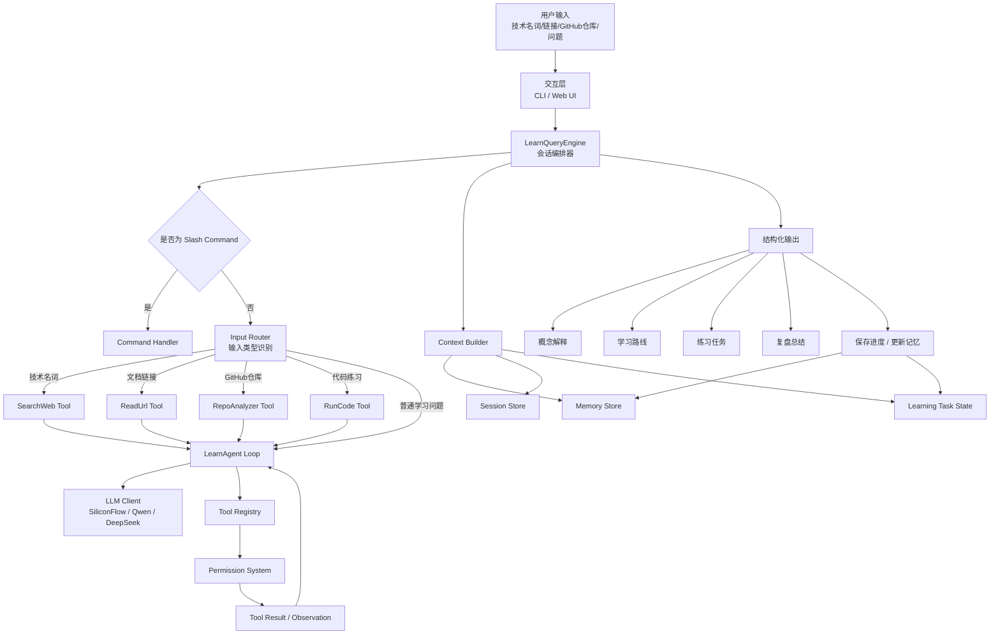

# LearnAgent 架构设计稿 V1

> 项目定位：LearnAgent 是一个面向自学者的 AI 学习助手，目标是帮助用户完成「发现新技术 → 理解核心概念 → 阅读资料/仓库 → 动手实践 → 复盘总结」的学习闭环。  
> 设计参考：Claude Code / Easy Agent 类 Agentic System 的工程分层思想，包括 QueryEngine、Agent Loop、Tool Registry、Memory、Plan Mode、Todo/Task、Skills、MCP、Sandbox 等模块。

---

## 1. 项目目标

### 1.1 核心目标

LearnAgent 不是普通问答机器人，而是一个具备工具调用、上下文管理、学习记忆和任务跟踪能力的学习型 Agent。

它需要支持：

1. 用户输入一个技术名词，Agent 自动搜索、阅读、提炼并生成学习路线。
2. 用户输入一个 GitHub 仓库，Agent 自动分析项目结构、核心模块、技术栈和可学习点。
3. 用户输入一个文档链接，Agent 自动读取、总结、提取知识点和练习任务。
4. 用户选择一个学习目标后，Agent 能生成循序渐进的学习计划。
5. 用户学习过程中，Agent 能跟踪进度、生成练习、批改反馈并做复盘。
6. Agent 能保存用户长期学习偏好、项目配置、学习进度和知识掌握情况。

---

## 2. 设计原则

### 2.1 Agent 化原则

LearnAgent 采用 Agentic Loop，而不是单轮问答模式：

```text
用户输入
→ QueryEngine 接管
→ 构造上下文
→ LLM 决策
→ 调用工具
→ 获得工具结果
→ 再次决策
→ 输出学习内容 / 学习计划 / 练习任务
→ 保存进度
```

核心公式：

```text
LearnAgent = QueryEngine + AgentLoop + ToolRegistry + ContextBuilder + MemoryStore + TaskTracker + Skills
```

### 2.2 工程分层原则

系统需要拆分为清晰模块：

```text
入口层
交互层
编排层
Agent Loop
LLM 通信层
工具层
上下文层
记忆层
任务层
安全层
扩展层
```

每一层职责独立，避免把所有逻辑写进一个 prompt 或一个 main.py 文件。

### 2.3 可靠性原则

LearnAgent 必须避免以下问题：

- 不查资料直接编造技术结论。
- 不区分短期会话和长期记忆。
- 工具调用结果无限塞入上下文。
- 学习计划生成后无法跟踪进度。
- 运行代码或修改文件时缺少安全边界。
- 用户切换主题后，历史上下文混乱。

---

## 3. 总体架构



---

## 4. 系统分层设计

### 4.1 入口层 Entry Layer

负责启动系统和接收用户输入。

可能入口：

```text
CLI
Web API
Web UI
Cursor / VS Code 插件
本地脚本
```

第一阶段建议先做 CLI 或 FastAPI，避免一开始就把前端做复杂。

职责：

```text
读取配置
初始化 LLMClient
初始化 ToolRegistry
初始化 MemoryStore
初始化 LearnQueryEngine
把用户输入交给 QueryEngine
```

---

### 4.2 交互层 UI Layer

负责展示，不负责核心逻辑。

需要展示：

```text
用户输入
模型流式输出
工具调用状态
学习任务进度
当前学习主题
当前 Todo
Slash command 结果
错误提示
```

CLI 可支持：

```text
/help
/clear
/topic
/progress
/plan
/tasks
/memory
/compact
/model
/skill
```

---

### 4.3 编排层 LearnQueryEngine

LearnQueryEngine 是 LearnAgent 的会话控制中心。

职责：

```text
管理 messages
管理 sessionId
管理当前学习主题
管理当前模型
管理 usage
处理 slash commands
调用 ContextBuilder
调用 Agent Loop
保存 session
触发上下文压缩
更新学习进度
```

核心伪代码：

```python
class LearnQueryEngine:
    def __init__(self, llm, tools, memory_store, session_store, task_store):
        self.llm = llm
        self.tools = tools
        self.memory_store = memory_store
        self.session_store = session_store
        self.task_store = task_store
        self.messages = []
        self.current_topic = None
        self.session_id = create_session_id()

    async def submit_message(self, user_input: str):
        if user_input.startswith("/"):
            return await self.handle_command(user_input)

        self.messages.append({
            "role": "user",
            "content": user_input
        })

        context = await build_learning_context(
            user_input=user_input,
            current_topic=self.current_topic,
            memory_store=self.memory_store,
            task_store=self.task_store,
        )

        system_prompt = build_system_prompt(context)

        self.messages = await maybe_compact_messages(self.messages)

        result = await learn_agent_loop(
            messages=self.messages,
            system_prompt=system_prompt,
            tools=self.tools,
            llm=self.llm,
        )

        self.messages = result.messages

        await self.session_store.append_messages(
            self.session_id,
            result.new_messages
        )

        await self.update_learning_state(result)

        return result
```

---

## 5. Agent Loop 设计

### 5.1 核心流程

```text
LLM
→ tool_use
→ ToolRegistry 找工具
→ Permission 判断
→ Tool 执行
→ tool_result
→ 回填 messages
→ LLM 继续推理
```

### 5.2 LearnAgent Loop 伪代码

```python
async def learn_agent_loop(messages, system_prompt, tools, llm, max_turns=8):
    for turn in range(max_turns):
        assistant = await llm.chat(
            messages=messages,
            system=system_prompt,
            tools=tools.to_api_schema(),
        )

        messages.append(assistant)

        tool_calls = extract_tool_calls(assistant)

        if not tool_calls:
            return AgentResult(
                messages=messages,
                reason="completed",
            )

        tool_results = []

        for call in tool_calls:
            tool = tools.find(call.name)

            if tool is None:
                tool_results.append(make_error_result(call, "Unknown tool"))
                continue

            decision = check_permission(tool, call.input)

            if decision.behavior == "deny":
                tool_results.append(make_error_result(call, decision.reason))
                continue

            if decision.behavior == "ask":
                approved = ask_user(decision.summary)
                if not approved:
                    tool_results.append(make_error_result(call, "User rejected"))
                    continue

            result = await tool.call(call.input, context={
                "session_id": current_session_id,
                "current_topic": current_topic,
            })

            tool_results.append(make_tool_result(call.id, result))

        messages.append({
            "role": "user",
            "content": tool_results
        })

    return AgentResult(
        messages=messages,
        reason="max_turns"
    )
```

### 5.3 注意事项

必须保证：

```text
assistant 的 tool_use 要加入 messages
tool_result 要作为 user message 加入 messages
tool_use_id 和 tool_result 要能对齐
工具失败也要返回 observation
必须有 max_turns 防止死循环
```

---

## 6. LLM 通信层设计

### 6.1 当前推荐配置

结合当前项目偏好，第一版推荐：

```text
LLM Provider: SiliconFlow
Chat Model: Qwen/Qwen2.5-7B-Instruct
Embedding Model: BAAI/bge-m3
Reranker Model: BAAI/bge-reranker-v2-m3
```

### 6.2 LLMClient 接口

```python
class LLMClient:
    async def chat(
        self,
        messages: list[dict],
        system: str | None = None,
        tools: list[dict] | None = None,
        max_tokens: int = 4096,
    ) -> dict:
        pass

    async def stream_chat(
        self,
        messages: list[dict],
        system: str | None = None,
        tools: list[dict] | None = None,
    ):
        pass
```

### 6.3 后续支持

后续可以扩展：

```text
DeepSeek
OpenAI Compatible API
Ollama
vLLM
Qwen Coder
本地小模型分类器
```

---

## 7. Tool 系统设计

### 7.1 Tool 基础接口

```python
class Tool:
    name: str
    description: str
    input_schema: dict

    def is_read_only(self) -> bool:
        return True

    def is_enabled(self) -> bool:
        return True

    async def call(self, tool_input: dict, context: dict) -> dict:
        raise NotImplementedError
```

### 7.2 ToolRegistry

```python
class ToolRegistry:
    def __init__(self):
        self.tools = {}

    def register(self, tool: Tool):
        self.tools[tool.name] = tool

    def find(self, name: str) -> Tool | None:
        return self.tools.get(name)

    def to_api_schema(self):
        return [
            {
                "name": tool.name,
                "description": tool.description,
                "input_schema": tool.input_schema,
            }
            for tool in self.tools.values()
            if tool.is_enabled()
        ]
```

---

## 8. 第一批工具设计

### 8.1 SearchWeb Tool

用途：

```text
搜索技术名词、官方文档、教程、文章、API 说明。
```

输入：

```json
{
  "query": "LangGraph official tutorial"
}
```

输出：

```json
{
  "content": "搜索结果摘要，包括标题、链接、摘要",
  "isError": false
}
```

权限：

```text
read-only
默认 allow
```

---

### 8.2 ReadUrl Tool

用途：

```text
读取网页正文，提取主要内容。
```

输入：

```json
{
  "url": "https://..."
}
```

输出：

```json
{
  "content": "网页正文摘要或清洗后的文本",
  "metadata": {
    "title": "...",
    "source": "..."
  }
}
```

---

### 8.3 ReadGitHubRepo Tool

用途：

```text
读取 GitHub 仓库 README、目录结构、关键文件。
```

输入：

```json
{
  "repo_url": "https://github.com/xxx/yyy",
  "focus": "architecture"
}
```

输出：

```json
{
  "content": "仓库结构、核心模块、学习价值",
  "files": [
    "README.md",
    "src/main.py"
  ]
}
```

---

### 8.4 SearchMemory Tool

用途：

```text
检索用户历史学习记忆、项目配置、偏好。
```

输入：

```json
{
  "query": "RAG 配置"
}
```

输出：

```json
{
  "content": "相关记忆条目"
}
```

---

### 8.5 SaveMemory Tool

用途：

```text
保存长期有价值的信息。
```

输入：

```json
{
  "type": "project",
  "name": "rag_project_config",
  "description": "用户当前 RAG 项目配置",
  "body": "..."
}
```

权限：

```text
session / memory write
默认 allow，但要避免乱存
```

---

### 8.6 LearningTodoWrite Tool

用途：

```text
维护当前学习任务进度。
```

输入：

```json
{
  "todos": [
    {
      "content": "理解 LangGraph 基本概念",
      "activeForm": "正在讲解 LangGraph 基本概念",
      "status": "in_progress"
    }
  ]
}
```

状态：

```text
pending
in_progress
completed
```

---

### 8.7 RunCode Tool

用途：

```text
运行用户练习代码或示例代码。
```

第一阶段可以先不做，第二阶段接入 Sandbox。

权限：

```text
default: ask
plan mode: deny
sandbox mode: allow with sandbox
```

---

## 9. 输入类型 Router

LearnAgent 需要识别用户输入类型。

### 9.1 输入类型

```text
技术名词
文档链接
GitHub 仓库链接
代码片段
报错信息
学习计划请求
复盘请求
普通问题
```

### 9.2 Router 输出

```json
{
  "intent": "learn_concept",
  "topic": "LangGraph",
  "confidence": 0.92,
  "suggested_tools": ["SearchWeb", "ReadUrl"]
}
```

### 9.3 示例

```text
用户：我想学习 LangGraph
→ intent: learn_concept

用户：https://github.com/huggingface/smolagents
→ intent: analyze_repo

用户：帮我复盘今天学的内容
→ intent: review_progress

用户：这段代码为什么报错？
→ intent: debug_code
```

---

## 10. Context Builder 设计

### 10.1 上下文来源

```text
当前用户输入
当前学习主题
用户长期偏好
当前学习进度
最近 session 摘要
相关 memory
当前 todo / task
检索到的资料片段
可用工具列表
```

### 10.2 System Prompt 分层

```text
Static Context
Dynamic Context
Tool Usage Rules
Learning Style Rules
Safety Rules
```

### 10.3 示例 Prompt 结构

```text
<STATIC_CONTEXT>
你是 LearnAgent，一个面向自学者的 AI 学习助手。
你的目标是帮助用户完成：
发现 → 理解 → 实践 → 复盘 的学习闭环。

原则：
1. 先解释核心概念，再给例子。
2. 遇到新技术，应优先搜索可靠资料。
3. 不要假装读过资料。
4. 学习内容要分层递进。
5. 需要时生成练习任务。
</STATIC_CONTEXT>

<DYNAMIC_CONTEXT>
当前学习主题：LangGraph
用户水平：有 LangChain 基础，正在学习 Agent 架构
最近进度：刚学习过 Tool Registry 和 Agent Loop
当前任务：生成 LangGraph 学习路线
相关记忆：用户偏好先讲原理，再给代码
</DYNAMIC_CONTEXT>

<TOOL_RULES>
SearchWeb 用于搜索资料。
ReadUrl 用于读取网页。
ReadGitHubRepo 用于分析仓库。
SaveMemory 只保存长期有价值的信息。
LearningTodoWrite 用于更新学习进度。
</TOOL_RULES>
```

---

## 11. Memory 系统设计

### 11.1 Memory 与 Session 的区别

| 类型 | 保存内容 | 用途 |
|---|---|---|
| Session | 完整对话流水 | 恢复当前会话 |
| Memory | 长期有价值信息 | 未来多次会话使用 |
| Task | 学习任务状态 | 跟踪学习进度 |

### 11.2 存储结构

推荐：

```text
~/.learn-agent/
├── sessions/
│   └── <project_key>/
│       ├── <session_id>.jsonl
│       └── latest
├── memory/
│   └── <project_key>/
│       ├── MEMORY.md
│       ├── user_profile.md
│       ├── project_config.md
│       └── learning_progress.md
└── tasks/
    └── <project_key>/
        ├── 1.json
        ├── 2.json
        └── .highwatermark
```

### 11.3 Memory 条目格式

```md
---
name: rag_project_config
description: 用户当前 RAG 原型项目配置
type: project
---

- API Provider: SiliconFlow
- Chat Model: Qwen/Qwen2.5-7B-Instruct
- Embedding Model: BAAI/bge-m3
- Reranker: BAAI/bge-reranker-v2-m3
- Project Goal: RAG 辅助编程题目生成系统
```

### 11.4 Memory 类型

```text
user
project
learning
feedback
reference
```

### 11.5 什么应该存

```text
用户长期学习偏好
当前项目长期配置
已经确认的架构决策
常用命令
长期学习目标
阶段性学习进度
用户反馈
```

### 11.6 什么不应该存

```text
用户刚说的“继续”
一次性报错
临时工具结果
模型中间推理
无长期价值的闲聊
```

---

## 12. Session 系统设计

### 12.1 JSONL Transcript

每个 session 保存为 JSONL：

```json
{"type": "session_meta", "sessionId": "...", "startedAt": "..."}
{"type": "message", "role": "user", "message": {...}}
{"type": "message", "role": "assistant", "message": {...}}
{"type": "tool_event", "name": "SearchWeb", "phase": "start"}
{"type": "usage", "input_tokens": 1000, "output_tokens": 300}
{"type": "learning_event", "topic": "LangGraph", "action": "start"}
```

### 12.2 恢复逻辑

```text
读取 latest
→ 找到 session jsonl
→ 解析合法 message
→ 恢复 messages
→ 恢复最近 todo/task 状态
→ 继续对话
```

---

## 13. 学习任务系统设计

### 13.1 TodoWrite

用于当前会话短任务：

```text
✓ 搜索 LangGraph 官方文档
▸ 正在总结核心概念
○ 生成练习项目
○ 复盘易错点
```

### 13.2 Task Graph

用于长期学习路线：

```text
#1 理解 Agent Loop
#2 理解 Tool Calling
#3 学习 LangGraph StateGraph
#4 实现最小 LangGraph Agent
#5 加入 Memory
#6 做一个 LearnAgent 子模块

#1 blocks #2
#2 blocks #3
#3 blocks #4
#4 blocks #5
#5 blocks #6
```

### 13.3 Task 数据结构

```json
{
  "id": "1",
  "subject": "理解 LangGraph StateGraph",
  "description": "学习 StateGraph、Node、Edge、State 的关系",
  "activeForm": "正在讲解 LangGraph StateGraph",
  "status": "pending",
  "blocks": ["2"],
  "blockedBy": [],
  "metadata": {
    "topic": "LangGraph",
    "difficulty": "medium"
  }
}
```

---

## 14. Plan Mode 设计

### 14.1 学习计划模式

Plan Mode 在 LearnAgent 中可用于：

```text
生成学习路线前，先搜索资料和分析用户基础
分析 GitHub 仓库前，先只读探索项目结构
设计练习项目前，先确认学习目标和难度
```

### 14.2 流程

```text
EnterLearningPlanMode
→ 只允许 SearchWeb / ReadUrl / ReadRepo / SearchMemory
→ 生成 learning_plan.md
→ 用户确认
→ ExitLearningPlanMode
→ 开始正式学习流程
```

### 14.3 Plan Mode 权限

允许：

```text
SearchWeb
ReadUrl
ReadGitHubRepo
SearchMemory
ReadLocalDoc
LearningTodoWrite
```

禁止：

```text
SaveProgress
RunCode
WriteProjectFile
EditFile
Bash
```

---

## 15. Skills 系统设计

### 15.1 Skill 目录

```text
skills/
├── learn-concept/
│   └── SKILL.md
├── read-repo/
│   └── SKILL.md
├── generate-practice/
│   └── SKILL.md
├── review-progress/
│   └── SKILL.md
└── rag-debug/
    └── SKILL.md
```

### 15.2 learn-concept Skill 示例

```md
---
name: learn-concept
description: 学习一个技术概念的标准流程
when_to_use: 当用户说“我想学习某技术/概念”时使用
allowed-tools:
  - SearchWeb
  - ReadUrl
  - SearchMemory
argument-hint: <topic>
---

请按以下流程帮助用户学习 $ARGUMENTS：

1. 判断用户是否已有相关基础。
2. 搜索官方文档和可靠资料。
3. 用一句话解释该技术解决什么问题。
4. 拆出 3-5 个核心概念。
5. 给出最小示例。
6. 生成一个循序渐进的学习路线。
7. 生成一个小练习。
8. 更新学习 Todo。
```

### 15.3 read-repo Skill 示例

```md
---
name: read-repo
description: 阅读 GitHub 仓库并提取学习价值
when_to_use: 当用户输入 GitHub 仓库链接时使用
allowed-tools:
  - ReadGitHubRepo
  - SearchWeb
argument-hint: <repo_url>
---

请按以下流程分析仓库 $ARGUMENTS：

1. 阅读 README。
2. 分析目录结构。
3. 找出核心模块。
4. 总结技术栈。
5. 说明项目解决的问题。
6. 提取适合学习的设计点。
7. 给出阅读顺序。
8. 给出可模仿的个人项目方向。
```

---

## 16. MCP / 外部工具扩展

### 16.1 未来可接入的外部工具

```text
GitHub MCP
Browser MCP
RAG Search MCP
Notion MCP
Local Files MCP
Code Sandbox MCP
Database MCP
```

### 16.2 MCP 工具命名

```text
mcp__github__read_repo
mcp__browser__read_page
mcp__rag__search_docs
mcp__sandbox__run_python
```

### 16.3 设计原则

无论工具来自内置还是 MCP，进入系统后都应该统一成 Tool：

```text
name
description
input_schema
is_read_only
call()
```

---

## 17. 安全与权限系统

### 17.1 权限行为

```text
allow
ask
deny
```

### 17.2 默认规则

```text
只读工具：allow
保存学习进度：allow
写项目文件：ask
运行代码：ask
危险命令：deny
plan mode 下写入/执行：deny
```

### 17.3 RunCode 安全策略

RunCode 必须：

```text
限制运行时间
限制输出长度
限制工作目录
禁止访问敏感路径
后续使用 Docker 沙箱
```

### 17.4 工具结果截断

长输出必须截断：

```text
网页正文过长
仓库文件过多
代码运行报错太长
搜索结果太多
```

避免一次工具结果撑爆上下文。

---

## 18. Token Budget 与上下文压缩

### 18.1 为什么需要

LearnAgent 会读取：

```text
网页
文档
仓库
历史学习记录
代码运行结果
```

这些都会撑大上下文。

### 18.2 压缩策略

```text
优先清理旧工具结果
保留最近几轮对话
旧学习过程压成摘要
长期知识写入 memory
不要把所有历史都塞进 prompt
```

### 18.3 学习摘要应保留

```text
当前学习主题
用户已掌握内容
用户困惑点
已讲过的例子
已完成练习
下一步任务
```

---

## 19. Slash Commands 设计

建议支持：

```text
/help
查看可用命令

/clear
清空当前会话

/topic
查看或切换当前学习主题

/progress
查看学习进度

/plan
进入学习计划模式

/tasks
查看当前学习任务

/memory
查看长期记忆

/save
保存当前总结

/review
复盘最近学习内容

/model
切换模型

/skills
查看可用 Skills
```

---

## 20. 推荐目录结构

```text
LearnAgent/
├── README.md
├── pyproject.toml
├── app/
│   ├── main.py
│   ├── entrypoint/
│   │   ├── cli.py
│   │   └── api.py
│   ├── core/
│   │   ├── query_engine.py
│   │   ├── agent_loop.py
│   │   ├── router.py
│   │   └── events.py
│   ├── llm/
│   │   ├── base.py
│   │   ├── siliconflow_client.py
│   │   └── openai_compatible.py
│   ├── tools/
│   │   ├── base.py
│   │   ├── registry.py
│   │   ├── search_web.py
│   │   ├── read_url.py
│   │   ├── read_repo.py
│   │   ├── memory_tools.py
│   │   ├── todo_tools.py
│   │   └── run_code.py
│   ├── context/
│   │   ├── system_prompt.py
│   │   ├── context_builder.py
│   │   ├── compaction.py
│   │   └── token_budget.py
│   ├── memory/
│   │   ├── session_store.py
│   │   ├── memory_store.py
│   │   ├── memory_index.py
│   │   └── schemas.py
│   ├── tasks/
│   │   ├── todo_store.py
│   │   ├── task_store.py
│   │   └── task_graph.py
│   ├── safety/
│   │   ├── permission.py
│   │   ├── sandbox.py
│   │   └── validators.py
│   ├── skills/
│   │   ├── loader.py
│   │   ├── registry.py
│   │   └── skill_tool.py
│   └── config/
│       └── settings.py
├── skills/
│   ├── learn-concept/
│   │   └── SKILL.md
│   ├── read-repo/
│   │   └── SKILL.md
│   └── review-progress/
│       └── SKILL.md
├── data/
├── tests/
└── docs/
```

---

## 21. 开发阶段规划

### 阶段 1：最小可用 Agent

目标：

```text
能对话
能调用工具
能搜索资料
能生成学习路线
```

任务：

```text
实现 LLMClient
实现 Tool 接口
实现 ToolRegistry
实现 Agent Loop
实现 LearnQueryEngine
实现 SearchWeb / ReadUrl
实现 learn-concept Skill
```

---

### 阶段 2：学习记忆与会话保存

目标：

```text
能保存学习进度
能恢复会话
能记住用户偏好
```

任务：

```text
实现 SessionStore
实现 MemoryStore
实现 MEMORY.md
实现 SearchMemory / SaveMemory
实现 /memory /progress
```

---

### 阶段 3：学习任务系统

目标：

```text
能维护学习 Todo
能生成学习路线任务图
能跟踪任务状态
```

任务：

```text
实现 LearningTodoWrite
实现 TaskStore
实现 TaskGraph
实现 /tasks
实现 learning_plan.md
```

---

### 阶段 4：GitHub 仓库学习

目标：

```text
输入 GitHub 仓库后，自动分析架构和学习价值
```

任务：

```text
实现 ReadGitHubRepo
实现 read-repo Skill
生成仓库阅读路线
生成可模仿项目建议
```

---

### 阶段 5：练习与代码运行

目标：

```text
能生成练习
能运行简单代码
能给出反馈
```

任务：

```text
实现 GeneratePractice Tool
实现 RunCode Tool
接入 Sandbox
实现练习记录
```

---

### 阶段 6：扩展系统

目标：

```text
接入 MCP / 更多 Skills / 多 Agent
```

任务：

```text
MCP Adapter
Browser Tool
RAG Search Tool
SubAgent for Repo Analysis
SubAgent for Practice Review
```

---

## 22. 第一阶段最小闭环

建议先实现这个闭环：

```text
用户：我想学习 LangGraph
→ Router 判断 learn_concept
→ SearchWeb 搜索资料
→ ReadUrl 读取官方文档
→ LLM 总结核心概念
→ LearningTodoWrite 写入学习任务
→ 输出学习路线
→ SaveMemory 保存当前主题
```

最小输出应包含：

```text
一句话解释
核心概念列表
学习路线
一个最小例子
一个练习任务
下一步建议
```

---

## 23. 示例交互

### 23.1 学习技术名词

用户：

```text
我想学习 LangGraph
```

Agent：

```text
1. 我会先搜索可靠资料。
2. LangGraph 是用于构建有状态、多步骤 Agent 工作流的框架。
3. 核心概念包括 StateGraph、Node、Edge、State、Checkpoint。
4. 建议学习路线如下……
5. 当前 Todo 已更新。
```

---

### 23.2 阅读 GitHub 仓库

用户：

```text
https://github.com/huggingface/smolagents 这个项目怎么学？
```

Agent：

```text
1. 读取 README。
2. 分析目录结构。
3. 总结核心模块。
4. 说明它体现的 Agent 设计模式。
5. 给出阅读顺序。
6. 生成一个可模仿的小项目。
```

---

### 23.3 复盘学习进度

用户：

```text
复盘一下我最近学的 agent 架构
```

Agent：

```text
你最近主要学习了：
1. Agent Loop
2. Tool Registry
3. Context Builder
4. Memory
5. Permission
6. Skills
7. MCP

你目前已经理解……
还需要加强……
下一步建议……
```

---

## 24. 风险与注意事项

### 24.1 技术风险

```text
模型 tool calling 能力不稳定
网页读取质量不稳定
搜索结果噪声高
上下文容易过长
记忆容易污染
代码运行有安全风险
```

### 24.2 产品风险

```text
学习计划太泛
练习任务太玩具
用户进度跟踪不准确
Agent 过度自动化导致用户失去掌控感
```

### 24.3 应对策略

```text
优先接可靠资料
输出时标注信息来源
记忆写入前做筛选
长上下文做摘要
运行代码必须沙箱
复杂任务先 Plan Mode
```

---

## 25. 总结

LearnAgent 的本质不是一个“会回答学习问题的 ChatBot”，而是一个学习任务执行系统。

它应该具备：

```text
搜索资料
阅读资料
理解概念
生成路线
生成练习
运行代码
跟踪进度
保存记忆
复盘总结
扩展技能
```

最终目标是形成学习闭环：

```text
发现新技术
→ 理解核心概念
→ 阅读文档/仓库
→ 动手实践
→ 反馈纠错
→ 复盘沉淀
→ 进入下一阶段
```

第一版不需要一次做完所有模块。建议先完成：

```text
LLMClient
ToolRegistry
AgentLoop
LearnQueryEngine
SearchWeb
ReadUrl
MemoryStore
LearningTodoWrite
learn-concept Skill
```

完成这几个模块后，LearnAgent 就已经具备最小 Agentic Learning Loop。
